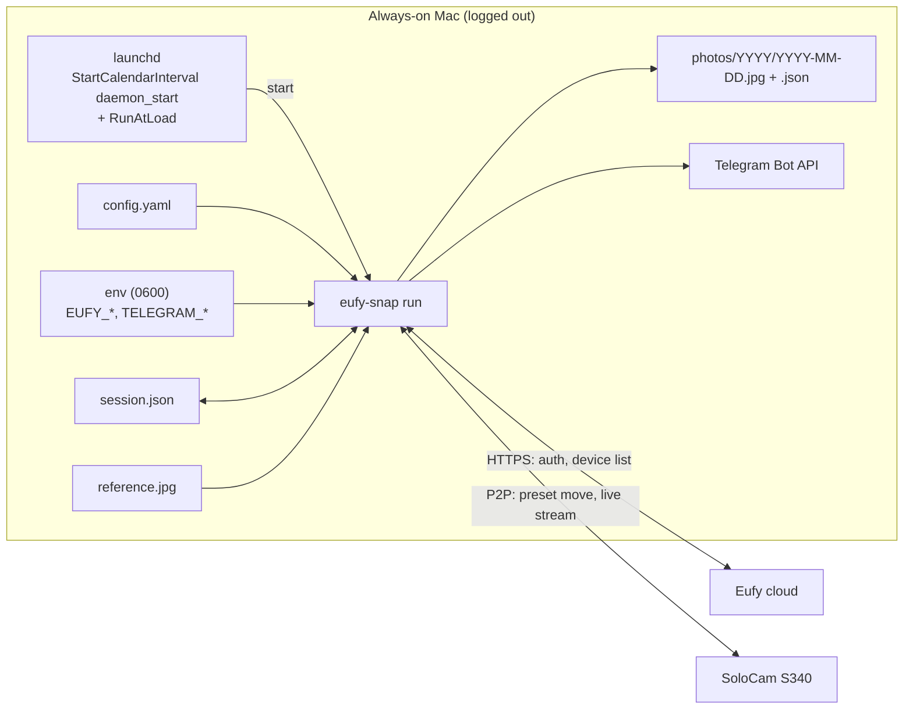

# eufy-snap

Take one photo a day from a **Eufy SoloCam S340** at sunrise or sunset — always from the same saved
preset, so the frames line up into a year-long time-lapse — keep every photo locally, and post each
one to a Telegram chat. Runs unattended on an always-on Mac as a LaunchDaemon.

Built on [`@mega-yfue/eufy-sdk`](https://github.com/mega-yfue/eufy-sdk) (the maintained successor to
`eufy-security-client`). Eufy has no official API; everything here is reverse-engineered and may break
when Eufy changes something — the tool fails loudly and tells you on Telegram when it does.

## How it works

Every day at `schedule.daemon_start`, launchd starts `eufy-snap run`. It computes today's sunrise or
sunset (`schedule.event`) for your latitude/longitude, sleeps until that time plus `offset_min`
(negative = before), then:

1. lists the camera's presets; *home* is `home_preset` if set, otherwise the camera's **default** preset
2. grabs a quick frame of where the camera is right now
3. moves to `shoot_preset` — the preset you aimed at the sun in the Eufy app — and polls frames until
   the view stops changing (a full pan takes ~18 s; `settle_ms` caps the wait)
4. captures a live frame, re-shooting until it is at least `min_width` wide
5. compares it with `reference.jpg` **and** with the pre-move frame; if the view is off, or the camera
   never moved, it moves again and re-shoots once
6. saves `photos/YYYY/YYYY-MM-DD.jpg` plus a `.json` sidecar (timings, verification, motion, warnings)
7. moves home, waits until still, and checks the frame matches the pre-move one
8. posts the photo to Telegram (if configured), or an alert if anything failed



`run` is idempotent: it exits if today's photo already exists, waits if it is early, catches up if it
is late by less than `catch_up_max_min`, and alerts + skips beyond that. A second concurrent `run` is
rejected by a lock file, and `RunAtLoad` makes a reboot or re-install harmless.

## Requirements

- macOS with Node ≥ 24.5 and ffmpeg on `PATH` (`brew install node ffmpeg`)
- A Eufy SoloCam S340 (other Eufy PTZ cameras with presets may work; untested)
- A **dedicated Eufy account** with the camera shared to it. Eufy allows one active session per
  device identity per account, so using your main account would keep logging your phone out.
- The camera aimed at the sunrise/sunset and **saved as a preset** in the Eufy app, and a decision
  about which preset is the camera's **default** (see [Camera notes](#camera-notes-solocam-s340))
- Optional: a Telegram bot (`@BotFather` → `/newbot`) and the chat id it should post to

## Setup

```bash
git clone https://github.com/atiannicelli/eufy-snap && cd eufy-snap
npm install && npm run build
mkdir -p ~/.eufy-snap
cp .env.example ~/.eufy-snap/env && chmod 600 ~/.eufy-snap/env   # EUFY_EMAIL / EUFY_PASSWORD / EUFY_COUNTRY (+ TELEGRAM_*)
cp config.example.yaml ~/.eufy-snap/config.yaml                  # edit: lat/lon, timezone, serial, presets, schedule

node dist/cli.js login                       # once; handles 2FA/captcha; saves ~/.eufy-snap/session.json
node dist/cli.js devices                     # your cameras, serials, and the live-view quality setting
node dist/cli.js presets <serial>            # preset slots, app numbering, and which one is the default
node dist/cli.js reference                   # shoot from shoot_preset → ~/.eufy-snap/reference.jpg — look at it!
node dist/cli.js plan --days 7               # today's sun event and shoot time, and the week ahead
node dist/cli.js telegram-test --photo       # prove the bot token / chat id by posting reference.jpg
node dist/cli.js snap                        # full run right now: move, shoot, verify, save, return, post
```

If `reference.jpg` is not the view you want, re-save the preset in the Eufy app and run `reference`
again (the previous one is kept as `reference.prev.jpg` and the shift between them printed).

### Telegram

1. In Telegram, talk to `@BotFather` → `/newbot` → copy the **token** (`123456789:AA…`).
2. Open your new bot and press **Start** (a bot cannot message you until you have messaged it).
3. `curl -s "https://api.telegram.org/bot<TOKEN>/getUpdates"` — the `"id"` inside `"chat"` is your chat id.
4. Put both in `~/.eufy-snap/env` as `TELEGRAM_BOT_TOKEN` and `TELEGRAM_CHAT_ID`; check with `telegram-test`.

Without them, `snap`/`run` save photos locally and skip delivery.

## Configuration

Everything the tool reads or writes lives under **`EUFY_SNAP_HOME`** (default `~/.eufy-snap`):

```
config.yaml       settings (no secrets)             env (0600)     EUFY_* and TELEGRAM_* secrets
session.json      Eufy session from `login`         openudid       stable device identity
reference.jpg     the frame at shoot_preset         photos/        YYYY/YYYY-MM-DD.jpg + .json
logs/             eufy-snap.log, launchd.*.log      run.lock       prevents overlapping runs
```

`config.example.yaml` is the commented template. Abridged:

```yaml
location:
  lat: 43.6231                  # decimal degrees
  lon: -70.2078
  timezone: America/New_York    # IANA name; drives DST and "which day is it"

camera:
  serial: T8170TXXXXXXXXXX      # from `eufy-snap devices`
  shoot_preset: 3               # CAMERA slot aimed at the sun — app "preset 4" (the app counts from 1, the camera from 0)
  # home_preset: 0              # optional; default = the camera's default preset, where it rests anyway
  settle_ms: 20000              # MAX wait for a pan; the run proceeds as soon as the view is still

schedule:
  event: sunset                 # sunrise | sunset
  offset_min: -10               # minutes relative to the event; negative = before
  daemon_start: "12:00"         # launchd trigger; must precede the earliest shoot time of the year (04:00 sunrise / 12:00 sunset)
  catch_up_max_min: 180         # daemon started late? still shoot if within this many minutes

capture:
  retries: 3
  min_width: 1920               # re-shoot while the stream is still delivering 720p
  min_width_wait_ms: 4000
  verify:
    max_shift: 0.03             # fraction of frame width vs reference.jpg
    max_mad: 25                 # grey-level MAD; lighting changes raise this, so keep it loose

store:
  dir: photos                   # relative to EUFY_SNAP_HOME

daemon:
  label: com.eufysnap.daily
  # user: eufysnap              # defaults to the installing user

telegram:
  chat_id_env: TELEGRAM_CHAT_ID # names of the env vars to read
  bot_token_env: TELEGRAM_BOT_TOKEN
```

**Preset numbering.** The Eufy app shows presets 1–4; the camera stores them in slots 0–3. Config uses
**camera slots** — app "preset 4" is `shoot_preset: 3`. `presets <serial>` prints both numberings and
marks the default.

**Where the camera rests.** The S340 returns to its *default* preset by itself about a minute after
every live session. So the default preset **is** your security view; `home_preset` is only useful for
an explicit immediate return and is warned about if it differs. Choose the default in the Eufy app or
with `presets <serial> --set-default <slot>`.

`-c, --config <file>` or `EUFY_SNAP_CONFIG` selects another config file; `.env` in the current
directory is also loaded (handy during development), then `$EUFY_SNAP_HOME/env`.

## Deploy as a LaunchDaemon

```bash
node dist/cli.js install        # renders the plist into EUFY_SNAP_HOME, checks prerequisites, prints the sudo steps
```

Run the printed commands — `sudo cp … /Library/LaunchDaemons/`, `sudo launchctl bootstrap system …`,
and `sudo pmset -a sleep 0 disksleep 0 womp 1 autorestart 1` so a logged-out Mac stays awake.
`install` never touches `/Library` itself. The plist carries only `PATH`, `HOME` and `EUFY_SNAP_HOME`;
secrets are read from `$EUFY_SNAP_HOME/env` at run time.

Re-run `install` + the `cp`/`bootstrap` steps after changing `daemon_start`, the Node path, or moving
the checkout. After editing anything else in `config.yaml` or `env`, restart the (possibly sleeping)
daemon so it re-reads them:

```bash
sudo launchctl kickstart -k system/com.eufysnap.daily
tail -f ~/.eufy-snap/logs/eufy-snap.log
node dist/cli.js run --at 17:45 --no-telegram     # rehearse the wait/shoot path at a chosen time
```

## Commands

| Command | Purpose |
|---|---|
| `login` | Interactive first-time login (2FA/captcha). Persists the session. |
| `devices [--json]` | Cameras, capabilities, serials, live-view Streaming Quality. |
| `presets <serial>` | Preset slots with app numbering and the default; `--goto`, `--save`, `--set-default`, `--image <id>` (download the slot's thumbnail). |
| `reference` | Capture the verification frame from `shoot_preset`; keeps the previous as `reference.prev.jpg`. |
| `plan [date] [--days n]` | Sun event and shoot time per day; flags days that would fire before `daemon_start`. |
| `snap [--no-telegram]` | Do the whole daily sequence now. |
| `run [--at HH:MM] [--no-telegram]` | Daemon entry point: wait / catch up / skip, then snap. |
| `telegram-test [--photo]` | Send a test message (or `reference.jpg`) to the configured chat without touching the camera. |
| `install [--print] [--node path]` | Render the LaunchDaemon plist and print the activation steps. |
| `dev …` | Low-level experiments: `rotate`, `snapshot`, `watch`, `sequence`, `sweep`. |

During development `node src/cli.ts …` (or `npm run dev -- …`) runs the TypeScript directly;
`npm run typecheck` also fails if the SDK's broken `preset.goto()` is ever called (see below).

### Exit codes

`0` ok · `1` error / skipped · `10` login needs a human (2FA/captcha) — run `login` interactively ·
`20` photo taken but the camera appears off-preset · `30` no usable frame · `40` photo saved but
Telegram delivery failed

### Telegram messages

Success: the photo with caption `Sunset 2026-09-20 · sunset 18:40 · shot 18:30 · 2880×1616`.
Off-preset: same photo, caption prefixed ⚠️. Failure: a text message with the error and a hint.
Silence therefore means the daemon did not run — check the log.

## Logging and troubleshooting

One line per event goes to stdout and `~/.eufy-snap/logs/eufy-snap.log`; each photo has a JSON sidecar
with the same facts. `EUFY_LOG_LEVEL=debug` adds per-frame detail and the SDK's own diagnostics.
`EUFY_SNAP_DEBUG_FRAMES=<dir>` keeps every frame a run looked at (pre-move, each settle poll, the shot,
the return) for a post-mortem.

| Symptom | Meaning / fix |
|---|---|
| `[p2p] send err … EHOSTUNREACH` spam | The Mac is not on the camera's LAN; the SDK falls back to Eufy's relay. Harmless. |
| Photos are 1920×1080 off-LAN but larger on the LAN | The camera's **Streaming Quality** is `Auto` and drops to 1080p over the relay. Set it to **Max** in the Eufy app (`devices` shows the current value). |
| `settle: view still changing after N s — proceeding anyway` | `settle_ms` is shorter than the pan. Use the default 20000; it is a cap, not a delay. |
| `off preset` / exit 20 with a half-turned photo | Usually the above; re-take `reference` after fixing it, since it may be a mid-pan frame too. |
| `home_preset N is not the camera's default …` | Either drop `home_preset` or make that preset the default in the app; the camera will not stay elsewhere. |
| `shoot_preset N is not stored on the camera` | Slots are 0-based: app "preset 4" is slot 3. |
| `P2P connect timeout` | The previous session has not been released yet (allow ~20 s between commands), or another `eufy-snap` is running. |
| exit 10 / "needs login" on Telegram | Eufy rejected the stored session. Run `login` once as the daemon's user. There is deliberately no automatic re-login loop — that is what triggers Eufy captchas. |

## Camera notes (SoloCam S340)

Things learned against a real S340 that shape the design:

- **`preset.goto()` in `@mega-yfue/eufy-sdk` 0.1.2 is a no-op on this camera.** It sends P2P command
  6032, which is the *save-preset* command (with a payload the camera ignores). The real move is
  `preview()`, P2P 6035 — absolute, persistent, and idempotent. All moves here go through
  `movePreset()`; `npm run typecheck` fails if `.goto(` reappears.
- **Moves are slow and unsignalled.** A full pan takes up to ~18 s and nothing tells you when it is
  done, so the tool watches frames until two consecutive ones match. A second PTZ command sent
  **mid-pan** leaves the camera at an unrelated position — never send one until the view is still.
- **The camera returns to its default preset by itself** about a minute after a live session ends
  (not while a stream is open). Your security view is whatever preset is marked default.
- **`rotate()` is press-and-hold, not a step.** Short bursts do nothing, longer ones sweep tens of
  degrees, and the SDK exposes no stop — so fine repositioning is not available, hence presets.
- **No position feedback.** `ptzNotify` carries no pan/tilt angles, hence image-based verification.
  The comparator (`src/frame-shift.ts`) is a horizontal-only search on 320×180 greyscale frames:
  good at "same view / moved / how far", blind to pure tilt and to lighting.
- **Frame size varies with stream state** (720p on the first keyframe, then 1080p–2880×1616). Polling
  during the settle keeps the stream warm and usually yields full resolution on the first shot;
  `min_width` guards the rest. Streaming Quality `Auto` caps the relay path at 1080p (see above).
- **Sessions.** One active session per account/device identity (the tool pins its `openudid`);
  back-to-back P2P sessions need ~15–20 s between them; PTZ writes are fire-and-forget.
- **Pan range** is ≈ 355° with hard end-stops; commands into a stop are dropped silently.

## Security

No secrets live in the repository or in `config.yaml`. `env` and `session.json` are 0600. Photos stay on
your Mac unless you configure Telegram, and that chat should be private. Pin the SDK version and test an
upgrade with `snap` before letting the daemon pick it up.

## Not (yet) covered

Video, motion events, multiple cameras, a web UI, weather-aware skipping, log rotation, and the
time-lapse assembly itself (a one-liner: `ffmpeg -pattern_type glob -i '~/.eufy-snap/photos/*/*.jpg' …`).

## License

MIT — see [LICENSE](LICENSE).
