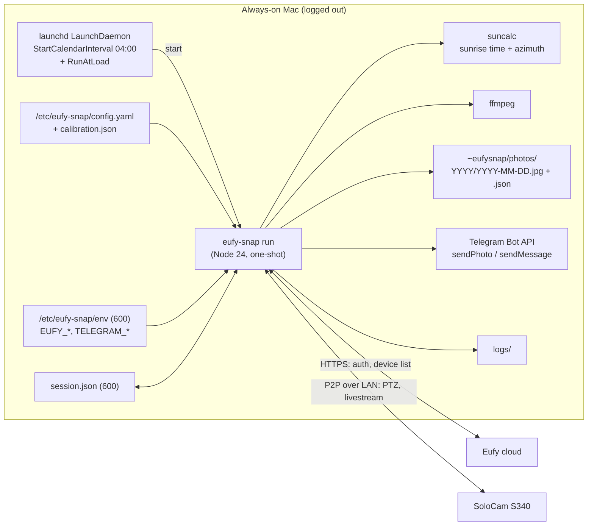
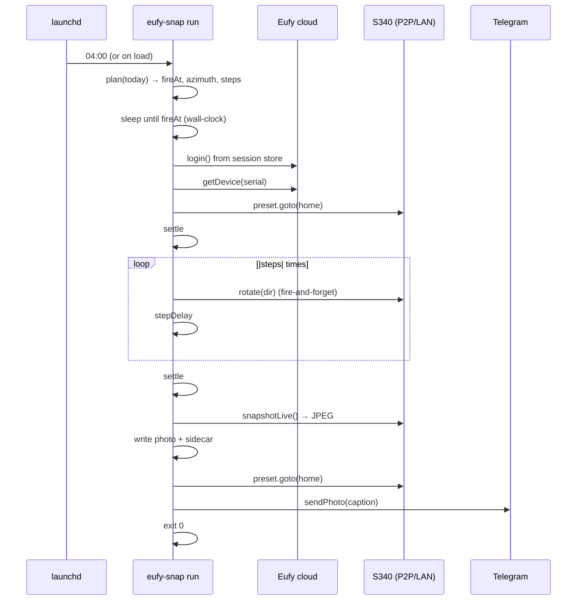

# eufy-snap — Design

> Status: **DRAFT v0.2** (2026-09-16). v0.1 assumed a fixed position and clock time; after
> requirements review the app is a **seasonal sunrise tracker** for a year-long time-lapse.

## 1. Goal

Every day, at sunrise (± a configured offset) for a configured location, aim a Eufy SoloCam S340
at the point on the horizon where the sun is rising that day, capture a wide-lens still, store it
locally forever, post it to a Telegram chat, and return the camera to its home position. Runs
unattended on an always-on Mac with no user logged in.

### Decisions locked in during requirements review

| Topic | Decision |
|---|---|
| Camera | **SoloCam S340 (T8170)**, standalone Wi‑Fi (no HomeBase), battery + solar, same LAN as the Mac. |
| Position | **Tool-owned.** Derived daily from the computed sunrise azimuth: `home preset → N rotate steps`. |
| Calibration | One-time guided calibration: home preset aimed at a compass bearing; step angle measured by counting steps for a full 360°. Mount stays fixed. |
| Zoom | Wide lens only, 1×. |
| Time | Sunrise + configurable offset (minutes), from lat/long. |
| After the shot | Return to the home preset. |
| Storage | Local folder on the Mac, keep everything. |
| Delivery | Post each day's photo to a **Telegram bot** chat; failures also go there, so silence is meaningful. |
| Runtime | macOS **LaunchDaemon** (works logged-out), dedicated service user. |
| Account | Dedicated secondary Eufy account, camera shared to it. |
| Language | TypeScript / Node 24 (dictated by the SDK). |

### Non-goals (v1)

Video, motion events, web UI, multiple cameras, cloud storage, weather-aware skipping.

## 2. Landscape & constraints (verified 2026-09-16)

| Fact | Consequence |
|---|---|
| Eufy has **no official API**; everything is reverse-engineered from the app. | Expect breakage on Eufy updates. Fail loud, pin versions, make the SDK easy to upgrade. |
| `bropat/eufy-security-client` + `eufy-security-ws` were **archived Sept 2026**; development moved to [`@mega-yfue/eufy-sdk`](https://github.com/mega-yfue/eufy-sdk) (v0.1.2, Apache-2.0, Node ≥ 24.5, ffmpeg for live JPEGs). | Build on `@mega-yfue/eufy-sdk`. Young, but the only maintained path and it speaks the current "mega/v6" cloud. |
| SDK has **persistent sessions** (`FileSessionStore`); restored sessions need no network; rejected tokens re-login with stored credentials unless a captcha/2FA is required. | One-shot process per day; only the first `login` is interactive. |
| One session per device identity per account; a second client evicts the first. | Dedicated account + a fixed `openudid`/`phoneModel` so the tool is one stable "device". |
| SDK PTZ on SoloCam: `ptz.rotate(dir)` step nudges, `ptz.preset().goto/save/list/setDefault`, rotate **speed 1/3/5 changes step travel**. All PTZ writes are **fire-and-forget, no ack**. | Open-loop positioning. Always move from a known origin (home preset), pin speed, wait a settle time, and re-derive absolute step count daily so error never accumulates. |
| S340 is **battery/solar, no RTSP**. Each P2P livestream wakes the camera and costs battery. | `camera.snapshotLive()` is the only fresh-frame path. Keep the session short (< ~60 s), one stream per day. |
| S340 stores up to **5 presets** and auto-returns to its default preset after a motion-tracking event, on a **firmware-controlled timer with no user setting**. | Use one preset as `home`. Motion tracking can move the camera during our sequence; see open item §11.1 for the spike test and mitigations. |
| S340 pans 360°, tilts ~70°. Sunrise is on the horizon, so tilt is constant. | Only pan varies day to day; tilt is baked into `home`. |
| Sunrise azimuth at mid-latitudes swings roughly ±30° around due east over the year, drifting 0.1–0.4°/day. | If a rotate step is a few degrees, the camera physically moves only every few days — matches the stated intent. |

## 3. Architecture



### Components

| Component | Responsibility |
|---|---|
| **CLI `eufy-snap`** | `login` (interactive 2FA/captcha), `devices`, `calibrate`, `plan [date]` (print sunrise time/azimuth/steps), `snap` (do the full sequence now), `run` (daemon entrypoint: wait for today's sunrise then snap), `install` (write + load LaunchDaemon), `doctor`. |
| **Sun model** | `suncalc`: sunrise time and azimuth for `location` on a date. Exposes `plan(date) → {fireAt, azimuthDeg}`. |
| **Positioner** | `azimuth → steps`: `steps = round(wrap(azimuth − home.azimuth) / calibration.degPerStep)`, direction from the sign. Sequence: `goto(home)` → settle → `rotate(dir) × |steps|` with `stepDelayMs` between → settle. Afterwards `goto(home)`. |
| **Calibrator** | Guided: (1) confirm `home` preset exists and record its compass bearing; (2) issue single steps, snapshotting each, until the user confirms the view has returned to start → `degPerStep = 360 / n`. Stores `calibration.json`. Optional refinement: pixel-shift between consecutive frames vs. known wide-lens FOV. |
| **Capturer** | `camera.snapshotLive()` → JPEG. Retries with backoff (camera may still be waking). |
| **Store** | `photos/YYYY/YYYY-MM-DD.jpg` + sidecar `YYYY-MM-DD.json` (sunrise UTC/local, azimuth, steps, degPerStep, camera FW, SDK version, duration, retries). Sidecars make the time-lapse assembly and any later re-calibration reproducible. |
| **Telegram** | On success: `sendPhoto` with caption `2026-09-16 · sunrise 06:31 · az 84.2° · 3 steps R`. On failure: `sendMessage` with the error class and a hint (e.g. "run `eufy-snap login`"). |
| **Scheduler** | LaunchDaemon: `StartCalendarInterval` at a pre-dawn time (configurable, default 04:00 local) plus `RunAtLoad`. `run` computes today's `fireAt`; if it is in the future, sleeps until then (checking the wall clock, not a monotonic timer, to survive system sleep); if it already passed and today's photo is missing → catch-up snap immediately; otherwise exit. A lock file prevents overlap. |

## 4. Daily sequence



Degraded paths:
- Snapshot fails after retries → Telegram error, exit 30, camera still returned home.
- Session needs a human (2FA/captcha) → Telegram "needs login", exit 10, **no login retry loop** (that is what triggers Eufy captchas/cooldowns).
- PTZ command throws (unsupported / P2P down) → attempt the snapshot anyway, flag `ptz_failed` in the sidecar and caption.

## 5. Configuration (proposed)

```yaml
# /etc/eufy-snap/config.yaml — no secrets in this file
location:
  lat: 42.36
  lon: -71.06
  timezone: America/New_York

camera:
  serial: T8170XXXXXXXXXXX
  home_preset: 0                # preset slot aimed at home.azimuth_deg (tilt = horizon)
  rotate_speed: 3               # 1 | 3 | 5 — must match calibration
  step_delay_ms: 800
  settle_ms: 6000

home:
  azimuth_deg: 90.0             # compass bearing the home preset faces (set during calibrate)

schedule:
  sunrise_offset_min: 5         # negative = before sunrise
  daemon_start: "04:00"         # pre-dawn launchd trigger; must precede earliest sunrise+offset

capture:
  retries: 3
  reference_frame_every_days: 7 # also snapshot at home before moving, to detect mount drift

store:
  dir: /Users/eufysnap/photos

telegram:
  chat_id_env: TELEGRAM_CHAT_ID
  bot_token_env: TELEGRAM_BOT_TOKEN
```

```
# /etc/eufy-snap/env  (root:eufysnap, 0600) — loaded by the plist via EnvironmentVariables
EUFY_EMAIL=...
EUFY_PASSWORD=...
TELEGRAM_BOT_TOKEN=...
TELEGRAM_CHAT_ID=...
```

`calibration.json` is written by `eufy-snap calibrate`: `{ degPerStep, stepsPer360, rotateSpeed, measuredAt }`.

## 6. Authentication

1. Create the dedicated Eufy account; from the main account share the camera to it.
2. `sudo -u eufysnap eufy-snap login` once — handles 2FA and captcha interactively, writes
   `session.json` (0600). Pin `openudid` + `phoneModel` in the SDK options so the tool is one stable device identity.
3. Daily runs restore the session. If Eufy rejects it and the SDK cannot self-heal, `run` exits 10 and
   posts to Telegram.

## 7. macOS deployment

- Dedicated user `eufysnap` (no login shell needed). Node 24 + ffmpeg via Homebrew; the plist sets an
  explicit `PATH` because daemons have none.
- `/Library/LaunchDaemons/com.eufysnap.daily.plist`: `UserName eufysnap`, `RunAtLoad true`,
  `StartCalendarInterval {Hour 4, Minute 0}`, `EnvironmentVariables` from the env file (rendered in by
  `install`), stdout/stderr to `/Users/eufysnap/logs/`.
- `sudo pmset -a sleep 0 disksleep 0; pmset -a womp 1` so a logged-out Mac stays awake.
- `install` renders the plist from config and `launchctl bootstrap system` loads it; `doctor` verifies
  Node/ffmpeg, session validity, camera reachable over P2P, `home_preset` exists in `preset.list()`,
  calibration present, store dir writable, daemon loaded, Telegram reachable.

## 8. Observability

- JSON-lines logs with a run id; sidecars per photo; Telegram is the human-facing channel.
- Exit codes: `0` ok · `10` auth needs human · `20` PTZ failed (photo taken) · `30` capture failed · `40` store/telegram failed.
- Weekly `reference_frame` at home before moving: a simple visual check (or later, automated pixel diff) that the mount has not shifted, which would silently invalidate calibration.

## 9. Security

No secrets in repo or `config.yaml`. `env`, `session.json` 0600. Photos are of your property — they stay
on the Mac; the Telegram chat should be private. Pin the SDK to an exact version; upgrade via `snap` test first.

## 10. Delivery phases

| Phase | Scope | Exit criterion |
|---|---|---|
| **0 — Spike** | `login`, `devices`, `presets`, single `rotate`, `snapshotLive` against the real S340. | PTZ moves, a fresh JPEG lands on disk, session restores without 2FA on second run. Also learn: does the S340 emit `ptzNotify` position events (enables verification, §11.1-D)? Does `snapshotLive` return the wide lens by default? How long does wake + stream take on battery? Does manual PTZ auto-return without motion? |
| **1 — MVP** | Sun model, `plan`, `calibrate`, Positioner, `snap`, `run` with wait/catch-up, local store + sidecars, LaunchDaemon `install`. | Runs unattended for 3 consecutive sunrises. |
| **2 — Hardening** | Telegram success/failure posts, retries and degraded paths, lock file, `doctor`, reference frames, pmset guidance. | A forced failure (wrong password) produces a Telegram alert, no login loop. |
| **3 — Later** | Pixel-shift auto-calibration, mount-drift detection, weather skip, time-lapse assembly script (`ffmpeg` glob → mp4), multiple cameras. | — |

## 11. Remaining open items

1. **Auto-return / motion tracking.** The S340 has **no user-visible auto-return timeout**; returning
   to the default preset is firmware behaviour that fires after a *motion-tracking* event ends, and
   community reports say its timing is inconsistent. Risk: motion tracking triggers mid-sequence, the
   camera follows the subject, then snaps home — ruining that day's frame.
   - *Spike test:* move the camera via the app, wait 3 min with no motion — does it return on its own?
     Then walk past it — does it track, and how long until it returns?
   - *Mitigation A (preferred):* turn **Motion Tracking (Pan & Tilt auto-tracking)** off in the app if
     it isn't needed; then nothing moves the camera but us.
   - *Mitigation B (chosen — owner relies on motion tracking):* have the tool disable motion tracking
     for the duration of the sequence and re-enable it afterwards. The SDK catalogs the wire command
     (`CMD_INDOOR_PAN_MOTION_TRACK` 6016, also `CMD_SET_CONTINUOUS_TRACKING_TIME` 1070) but exposes
     **no typed method and no raw-send escape hatch** — its policy is that unverified writes throw. So
     this needs a small **upstream PR** adding e.g. `dev.ptz().motionTracking(enabled)` (grounded in the
     app's command builder, per the SDK's contribution rules), or a temporary local patch until merged.
   - *Mitigation D (verify, don't just prevent):* the SDK decodes PTZ position notifications
     (`ptzNotify`, pan/tilt floats) for some models. If the S340 reports them, the tool reads the pan
     after positioning, compares it to the expected value, and re-runs `goto(home) → steps` if tracking
     moved the camera. Spike must confirm whether the S340 emits these.
   - *Mitigation C:* keep the sequence short (< 45 s) and accept a rare lost frame; the sidecar records
     it if `snapshotLive` shows the home view (detectable later via pixel diff against the reference frame).
2. **Rotate step size** — unknown until calibration; if it turns out coarse (≥ 10°), the "tiny daily change" will be a jump every 1–3 months instead. Acceptable?
3. **Horizon vs. true sunrise**: if trees/buildings hide the horizon, the visible "sunrise" is later and slightly further south; `sunrise_offset_min` covers time, but does the azimuth need a fixed bias too? (Trivial to add `azimuth_bias_deg`.)
4. **Battery budget**: one ~30–60 s stream per day is fine on solar; a weekly reference frame doubles that one day a week. Confirm the camera holds charge through winter.
5. **Location precision**: lat/lon to ~0.01° is plenty; timezone must be the IANA name for DST.
6. **Spike findings** may change the Positioner (position events → closed-loop) and settle timings.
