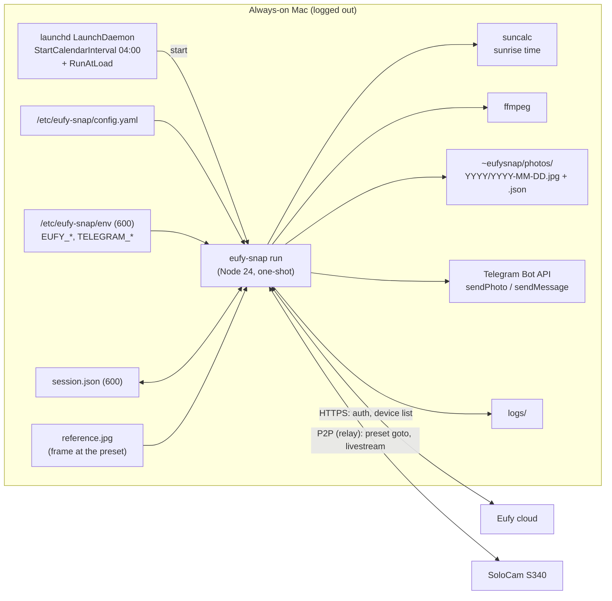
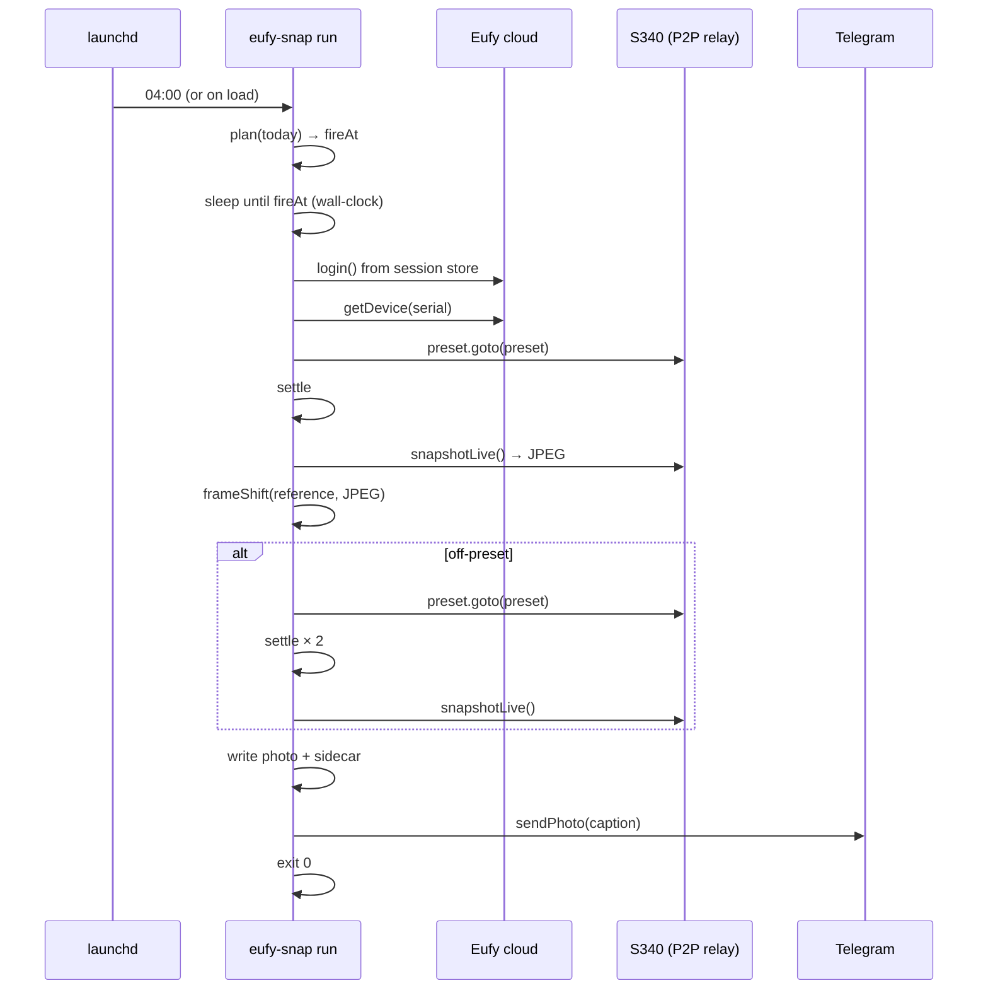

# eufy-snap — Design

> Status: **DRAFT v0.3** (2026-09-16). v0.1 assumed a fixed position and clock time; v0.2 was a
> seasonal *sunrise tracker* that re-aimed the camera daily. The Phase 0 spike (§10.1) showed the
> S340's pan control is press-and-hold and coarse — not steppable finely enough for a smooth
> time-lapse — so v0.3 shoots from a **fixed preset** and only tracks sunrise *time*.

## 1. Goal

Every day, at sunrise (± a configured offset) for a configured location, make sure a Eufy SoloCam S340
is sitting on a chosen preset, capture a wide-lens still, store it locally forever, and post it to a
Telegram chat. The frame is identical all year; the sun rises at a different point of it each day
(≈ 66° of azimuth swing over the year at 44°N, comfortably inside the wide lens if the preset faces
roughly ESE). Runs unattended on an always-on Mac with no user logged in.

### Decisions locked in during requirements review

| Topic | Decision |
|---|---|
| Camera | **SoloCam S340 (T8170)** "Bailey Island", `T8170T1025073FBB`, standalone Wi‑Fi (no HomeBase), battery + solar. Reached over Eufy's P2P relay (the Mac is not on its LAN). |
| Position | **Fixed preset**, aimed once by the owner in the Eufy app. The tool never calls `rotate()`; it only `goto`s the preset and **verifies** it got there (§3 Presetter). |
| Preset choice | Recommend making it the camera's **default preset**, so the firmware's own auto-return after motion tracking brings the camera back to our frame anyway. |
| Zoom | Wide lens only, 1×. |
| Time | Sunrise + configurable offset (minutes), from lat/long, via `suncalc`. |
| After the shot | Nothing to undo — the camera is already on its preset. |
| Storage | Local folder on the Mac, keep everything, JSON sidecar per photo. |
| Delivery | Post each day's photo to a **Telegram bot** chat; failures also go there, so silence is meaningful. |
| Runtime | macOS **LaunchDaemon** (works logged-out), dedicated service user. |
| Account | Dedicated secondary Eufy account, camera shared to it. |
| Language | TypeScript / Node 24 (dictated by the SDK). |

### Non-goals (v1)

Moving the camera, video, motion events, web UI, multiple cameras, cloud storage, weather-aware skipping.

## 2. Landscape & constraints (verified 2026-09-16)

| Fact | Consequence |
|---|---|
| Eufy has **no official API**; everything is reverse-engineered from the app. | Expect breakage on Eufy updates. Fail loud, pin versions, make the SDK easy to upgrade. |
| `bropat/eufy-security-client` + `eufy-security-ws` were **archived Sept 2026**; development moved to [`@mega-yfue/eufy-sdk`](https://github.com/mega-yfue/eufy-sdk) (v0.1.2, Apache-2.0, Node ≥ 24.5, ffmpeg for live JPEGs). | Build on `@mega-yfue/eufy-sdk`. Young, but the only maintained path and it speaks the current "mega/v6" cloud. |
| SDK has **persistent sessions** (`FileSessionStore`); restored sessions need no re-auth. ✅ Verified: second run restored without 2FA. | One-shot process per day; only the first `login` is interactive. |
| One session per device identity per account; a second client evicts the first. | Dedicated account + a fixed `openudid` so the tool is one stable "device". |
| **PTZ writes are fire-and-forget, no ack**, and on the S340 `ptz.rotate()` is a *press-and-hold keep-alive*, not a step (§10.1). `preset.goto()` **can silently fail** (observed from the far end-stop). | Never trust a move. Verify the frame against a stored reference and retry; alert if still off. |
| `camera.snapshotLive()` is the fresh-frame path; each stream wakes the camera and costs battery. Cold snapshot 5–8 s; frame size **varies** (1280×720, 2304×1296, 2880×1616) with stream state. | One short session per day. Accept a frame only above a configured minimum width, else re-shoot after a short wait. |
| Back-to-back P2P sessions can hit `P2P connect timeout` until the camera releases the previous one (~15–20 s). | Retry connect with a 20 s backoff; never run two sessions concurrently (lock file). |
| S340 exposes **10 preset slots** (`list()` returns all; occupied = `raw.enable === 1`, default = `raw.isdefault === 1`) and auto-returns to the default preset after a motion-tracking event on a firmware timer with no user setting. | Make our preset the default. Motion tracking is the only thing that can move the camera off-frame at shot time; verification catches it. |
| S340 pan range ≈ 355° with hard end-stops; commands into a stop are silently dropped. | Irrelevant to a preset design, except that `goto` from a stop failed once — hence verify + retry. |

## 3. Architecture



### Components

| Component | Responsibility |
|---|---|
| **CLI `eufy-snap`** | `login` (interactive 2FA/captcha), `devices`, `presets` (list / goto / set-default), `reference` (goto preset, snapshot, store as `reference.jpg`), `plan [date]` (print sunrise and fire time), `snap` (do the full sequence now), `run` (daemon entrypoint: wait for today's fire time then snap), `install` (write + load LaunchDaemon), `doctor`. Spike-only commands (`rotate`, `sweep`, `watch`, `sequence`) stay behind a `dev` group. |
| **Sun model** | `suncalc`: sunrise for `location` on a date. `plan(date) → {sunrise, fireAt}`. |
| **Presetter** | `goto(preset)` → settle → `snapshotLive()` → `frameShift(reference, frame)`; on-preset if `|shift| < max_shift` and `mad < max_mad`. If off: `goto` again with a longer settle and re-shoot (once). Still off → keep the frame, flag `off_preset`, alert. |
| **Capturer** | `snapshotLive()` with retries; re-shoot if `width < min_width` (stream still low-res). |
| **Frame compare** | `src/frame-shift.ts`: both frames to 320×180 grey, brute-force horizontal MAD search. Good enough for "same view / moved / how much"; not general registration. |
| **Store** | `photos/YYYY/YYYY-MM-DD.jpg` + sidecar `.json` (sunrise UTC/local, fireAt, actual shot time, width×height, shift vs reference, retries, `off_preset`, camera FW, SDK version, duration). |
| **Telegram** | On success: `sendPhoto` with caption `2026-09-16 · sunrise 06:31 · shot 06:36`. On `off_preset`: same photo, caption prefixed ⚠️. On failure: `sendMessage` with the error class and a hint (e.g. "run `eufy-snap login`"). |
| **Scheduler** | LaunchDaemon: `StartCalendarInterval` pre-dawn (default 04:00 local) plus `RunAtLoad`. `run` computes today's `fireAt`; if in the future, sleeps until then (wall clock, not a monotonic timer, to survive system sleep); if already passed and today's photo is missing → catch-up snap; otherwise exit. Lock file prevents overlap. |

## 4. Daily sequence



Degraded paths:
- Snapshot fails after retries → Telegram error, exit 30.
- Session needs a human (2FA/captcha) → Telegram "needs login", exit 10, **no login retry loop** (that is what triggers Eufy captchas/cooldowns).
- Off-preset after retry → photo kept and posted with ⚠️, sidecar `off_preset: true`, exit 20.
- P2P connect timeout → wait 20 s, retry up to 3×.

## 5. Configuration (proposed)

```yaml
# /etc/eufy-snap/config.yaml — no secrets in this file
location:
  lat: 43.73
  lon: -69.99
  timezone: America/New_York

camera:
  serial: T8170T1025073FBB
  preset: 1                     # slot to shoot from; make it the camera's default preset
  settle_ms: 6000               # after goto, before shooting

schedule:
  sunrise_offset_min: 5         # negative = before sunrise
  daemon_start: "04:00"         # pre-dawn launchd trigger; must precede earliest sunrise+offset

capture:
  retries: 3
  min_width: 1920               # re-shoot if the stream is still delivering 720p
  verify:
    max_shift: 0.03             # fraction of frame width vs reference.jpg
    max_mad: 25                 # grey-level MAD; lighting changes raise this, so keep it loose

store:
  dir: /Users/eufysnap/photos

telegram:
  chat_id_env: TELEGRAM_CHAT_ID
  bot_token_env: TELEGRAM_BOT_TOKEN
```

```
# /etc/eufy-snap/env  (root:eufysnap, 0600) — loaded by the plist via EnvironmentVariables
EUFY_EMAIL=...
EUFY_PASSWORD=...
TELEGRAM_BOT_TOKEN=...
TELEGRAM_CHAT_ID=...
```

`reference.jpg` is written by `eufy-snap reference` (goto preset → settle → snapshot) and should be
re-taken whenever the owner re-aims the preset. A daytime reference compares better than a dawn one;
the verifier ignores the top 10 % (sky) and bottom 30 % (near field) of the frame.

## 6. Authentication

1. Create the dedicated Eufy account; from the main account share the camera to it.
2. `sudo -u eufysnap eufy-snap login` once — handles 2FA and captcha interactively, writes
   `session.json` (0600). `openudid` is pinned in `~/.eufy-snap/openudid` so the tool is one stable device identity.
3. Daily runs restore the session. If Eufy rejects it and the SDK cannot self-heal, `run` exits 10 and
   posts to Telegram.

## 7. macOS deployment

- Dedicated user `eufysnap` (no login shell needed). Node 24 + ffmpeg via Homebrew; the plist sets an
  explicit `PATH` because daemons have none.
- `/Library/LaunchDaemons/com.eufysnap.daily.plist`: `UserName eufysnap`, `RunAtLoad true`,
  `StartCalendarInterval {Hour 4, Minute 0}`, `EnvironmentVariables` from the env file (rendered in by
  `install`), stdout/stderr to `/Users/eufysnap/logs/`.
- `sudo pmset -a sleep 0 disksleep 0; pmset -a womp 1` so a logged-out Mac stays awake.
- `install` renders the plist from config and `launchctl bootstrap system` loads it; `doctor` verifies
  Node/ffmpeg, session validity, camera reachable over P2P, `preset` occupied (and warns if not the
  default), `reference.jpg` present, store dir writable, daemon loaded, Telegram reachable.

## 8. Observability

- JSON-lines logs with a run id; sidecars per photo; Telegram is the human-facing channel.
- Exit codes: `0` ok · `10` auth needs human · `20` off-preset (photo taken) · `30` capture failed · `40` store/telegram failed.
- Every photo is compared to the reference, so mount drift or a re-aimed preset shows up the same day.

## 9. Security

No secrets in repo or `config.yaml`. `env`, `session.json` 0600. Photos are of your property — they stay
on the Mac; the Telegram chat should be private. Pin the SDK to an exact version; upgrade via `snap` test first.

## 10. Delivery phases

| Phase | Scope | Exit criterion |
|---|---|---|
| **0 — Spike** ✅ | `login`, `devices`, `presets`, `rotate`, `snapshotLive`, `sequence`, `sweep` against the real S340. | Done 2026-09-16; findings in §10.1. |
| **1 — MVP** | Sun model, `plan`, `reference`, Presetter (goto + verify), `snap`, `run` with wait/catch-up, local store + sidecars, LaunchDaemon `install`. | Runs unattended for 3 consecutive sunrises. |
| **2 — Hardening** | Telegram success/failure posts, retries and degraded paths, lock file, `doctor`, pmset guidance. | A forced failure (wrong password) produces a Telegram alert, no login loop. |
| **3 — Later** | Time-lapse assembly script (`ffmpeg` glob → mp4), weather skip, multiple cameras, tilt/pan re-aim if the SDK ever gains a stop command. | — |

### 10.1 Phase 0 findings (S340 `T8170T1025073FBB`, firmware as of 2026-09-16)

- **Login / session**: 2FA once, then `session.json` restores with no network auth. Two S340s on the
  account; both report `PTZ BATTERY CAMERA RTSP ZOOM PRESETS` (the `RTSP` flag is unexpected for a
  battery cam — unverified, not relied on).
- **Connectivity**: the Mac is not on the camera's LAN; P2P goes via Eufy relay in ~3 s (LAN attempts
  to the camera's private IP fail with `EHOSTUNREACH`, harmless noise). Starting a new session
  within ~15 s of the last one → `P2P connect timeout`.
- **Snapshot**: `snapshotLive()` cold ≈ 5–8 s (relay). Returned 1280×720, 2304×1296 and 2880×1616 on
  different calls — the JPEG is whatever keyframe the stream is on. Wide lens by default.
- **Presets**: `list()` returns 10 slots; owner's slots 0–3 occupied, **#1 is default**. `goto(1)`
  worked repeatedly from nearby positions but **silently did nothing** when the camera was parked
  at the far (right) end-stop — four consecutive attempts, no error, no movement. Root cause
  unknown (firmware refusal at the stop? long-travel goto being cancelled?). ⇒ verify + retry.
- **Rotate**: `rotate()` is **not a step**. 1, 2, 3 or 4 commands (200–2000 ms apart) never moved the
  camera, nor did 6 commands 200 ms apart; bursts of 6 at 600 ms moved it ≈ 85° (more than half the
  wide frame), and ~25 commands swept the full ≈ 355° range in both directions. Consistent with the
  app's press-and-hold: the camera moves while a keep-alive stream of sufficient length arrives, and
  the SDK exposes no stop (`cmd_type: 0`) to shorten a burst. The `zoom` argument (claimed to scale
  step size) made no difference at 1 vs 4. Speed 1/3/5 untested.
  **Conclusion: no fine positioning available → fixed-preset design.**
- **End-stops**: pan is ≈ 355° with hard stops; commands into a stop are dropped silently and
  `ptzNotify` does not flag it (`{"kind":"rotate","payload":{"limit":0}}` throughout).
- **Position feedback**: none. `ptzNotify` on the S340 carries only `{limit}` on rotate and
  `{dstZoom}` on stream start — no pan/tilt angles. Hence image-based verification.
- **Idle behaviour**: a manually moved camera stayed put for ≥ 2 min with no motion event — the
  firmware auto-return is tied to motion tracking, not to idle time.

## 11. Remaining open items

1. **Aiming the preset.** Owner re-aims the chosen preset in the Eufy app so the sunrise sector
   (≈ 57°–123° true over the year at Bailey Island) sits in frame with the horizon in the upper
   third, then runs `eufy-snap reference`. Which slot — reuse #1 (already default) or a new slot
   set as default? If a new slot, motion tracking will return there instead of the owner's current #1.
2. **`goto` failure mode.** Reproduce: park at an end-stop, `goto` with 20 s settle — does it need
   time, or does it refuse? Affects the retry strategy (longer settle vs. give up). Low stakes for
   v1 because the camera lives on the preset anyway.
3. **Motion tracking at shot time.** If a tracking event is in progress at `fireAt`, the frame is
   off-preset; the verifier retries once after settle × 2. Is one retry enough, or wait up to N minutes?
4. **Frame size policy.** `min_width: 1920` means ≈ 2304 or 2880 wide frames; how long to wait for the
   stream to upgrade before accepting 720p? Spike saw the change within ~2 min of stream start.
5. **Battery budget**: one ~20–40 s stream per day is fine on solar; confirm through winter.
6. **Location precision**: lat/lon to ~0.01° is plenty; timezone must be the IANA name for DST.
7. **Upstream**: worth filing with the SDK — S340 `rotate()` needs a keep-alive stream, and a
   `stop`/`cmd_type: 0` would make fine moves possible (re-opens the tracking design as Phase 3).
