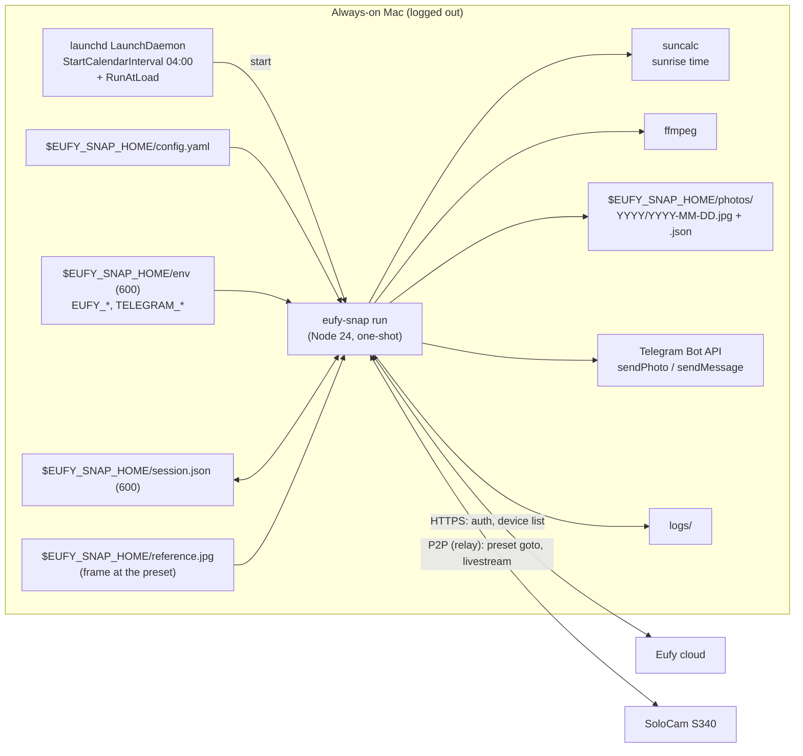

# eufy-snap — Design

> Status: **v0.5 — preset "goto" bug fixed; home = the camera's default** (2026-09-17). v0.1 assumed a fixed position and clock time; v0.2 was a
> seasonal *sunrise tracker* that re-aimed the camera daily. The Phase 0 spike (§10.1) showed the
> S340's pan control is press-and-hold and coarse — not steppable finely enough for a smooth
> time-lapse — so v0.3 shoots from a **fixed preset** and only tracks sunrise *time*. v0.4 recorded
> Phase 1 and moved all runtime files under one `EUFY_SNAP_HOME`. v0.5: the SDK's `preset.goto()`
> turned out to be a **no-op** on the S340 (§10.3); the app now moves with `preview()` (P2P 6035),
> waits until the view stops changing, proves motion against a pre-move frame, and returns to the
> camera's *default* preset — the one the camera drifts back to by itself anyway (§10.4).

## 1. Goal

Every day, at sunrise (± a configured offset) for a configured location, make sure a Eufy SoloCam S340
is sitting on a chosen preset, capture a wide-lens still, store it locally forever, and post it to a
Telegram chat. The frame is identical all year; the sun rises at a different point of it each day
(≈ 66° of azimuth swing over the year at 44°N, comfortably inside the wide lens if the preset faces
roughly ESE). Runs unattended on an always-on Mac with no user logged in.

### Decisions locked in during requirements review

| Topic | Decision |
|---|---|
| Camera | **SoloCam S340 (T8170)** "Bailey Island", `T8170T1025073FBB`, standalone Wi‑Fi (no HomeBase), battery + solar. Reached over Eufy's P2P relay (the Mac is not on its LAN). |
| Position | **Fixed preset** — camera slot 3, "preset 4" in the Eufy app (`shoot_preset`), aimed once by the owner in the Eufy app. The tool never calls `rotate()`; it only moves to the preset (`movePreset`, §10.3) and **verifies** it got there (§3 Presetter). |
| Preset choice | Shot from **#4**. Home is the camera's **default preset** — the S340 returns there by itself about a minute after every live session (§10.4), so that is the owner's security view whether we like it or not; the owner picks *which* preset is default in the Eufy app. |
| Zoom | Wide lens only, 1×. |
| Time | Sunrise + configurable offset (minutes), from lat/long, via `suncalc`. |
| After the shot | `movePreset(home)` — back to the default preset immediately rather than a minute later (`home_preset` may pin a different slot, but the camera will not stay there). |
| Storage | Local folder on the Mac, keep everything, JSON sidecar per photo. |
| Delivery | Post each day's photo to a **Telegram bot** chat; failures also go there, so silence is meaningful. |
| Runtime | macOS **LaunchDaemon** (works logged-out), dedicated service user. |
| Account | Dedicated secondary Eufy account, camera shared to it. |
| Language | TypeScript / Node 24 (dictated by the SDK). |

### Non-goals (v1)

Moving the camera, video, motion events, web UI, multiple cameras, cloud storage, weather-aware skipping.

## 2. Landscape & constraints (verified 2026-09-16)

| Fact | Consequence |
|---|---|
| Eufy has **no official API**; everything is reverse-engineered from the app. | Expect breakage on Eufy updates. Fail loud, pin versions, make the SDK easy to upgrade. |
| `bropat/eufy-security-client` + `eufy-security-ws` were **archived Sept 2026**; development moved to [`@mega-yfue/eufy-sdk`](https://github.com/mega-yfue/eufy-sdk) (v0.1.2, Apache-2.0, Node ≥ 24.5, ffmpeg for live JPEGs). | Build on `@mega-yfue/eufy-sdk`. Young, but the only maintained path and it speaks the current "mega/v6" cloud. |
| SDK has **persistent sessions** (`FileSessionStore`); restored sessions need no re-auth. ✅ Verified: second run restored without 2FA. | One-shot process per day; only the first `login` is interactive. |
| One session per device identity per account; a second client evicts the first. | Dedicated account + a fixed `openudid` so the tool is one stable "device". |
| **PTZ writes are fire-and-forget, no ack**, and on the S340 `ptz.rotate()` is a *press-and-hold keep-alive*, not a step (§10.1). The SDK's `preset.goto()` is a **no-op** on this camera (§10.3). | Never trust a move. Move with `movePreset()`, wait until the view stops changing, verify the frame against a stored reference *and* against a pre-move frame; retry; alert if still off. |
| `camera.snapshotLive()` is the fresh-frame path; each stream wakes the camera and costs battery. Cold snapshot 5–8 s; frame size **varies** (1280×720, 2304×1296, 2880×1616) with stream state. A stream left idle > ~12 s restarts unreliably. | One short session per day; keep the stream warm by polling frames while the camera pans. Accept a frame only above a configured minimum width, else re-shoot after a short wait. |
| Back-to-back P2P sessions can hit `P2P connect timeout` until the camera releases the previous one (~15–20 s). | Retry connect with a 20 s backoff; never run two sessions concurrently (lock file). |
| S340 exposes **10 preset slots** (`list()` returns all; occupied = `raw.enable === 1`, default = `raw.isdefault === 1`) and **moves back to the default preset by itself ~1 min after every live session** (§10.4), as well as after motion tracking. Positioning is absolute: a move to the slot it is already on is a no-op. | Shoot from #4; home defaults to the camera's default slot. The pre-move frame therefore shows the camera *at its default*, which is what the return-home check compares against. |
| S340 pan range ≈ 355° with hard end-stops; commands into a stop are silently dropped. A PTZ command issued **while a pan is still in progress** leaves the camera at an unrelated position. | Never send a second move until the view has stopped changing. |

## 3. Architecture



### Components

| Component | Responsibility |
|---|---|
| **CLI `eufy-snap`** | `login` (interactive 2FA/captcha), `devices`, `presets` (list / move / set-default), `reference` (move to preset, snapshot, store as `reference.jpg`), `plan [date]` (print sunrise and fire time), `snap` (do the full sequence now), `run` (daemon entrypoint: wait for today's fire time then snap), `install` (write + load LaunchDaemon), `doctor`. Spike-only commands (`rotate`, `sweep`, `watch`, `sequence`) stay behind a `dev` group. |
| **Sun model** | `suncalc`: sunrise for `location` on a date. `plan(date) → {sunrise, fireAt}`. |
| **Presetter** | `list()` → home = `home_preset` or the camera's default slot (warn if they differ, §10.4). Pre-move `snapshotLive()` → `movePreset(shoot_preset)` (P2P 6035 — see §10.3; **never** the SDK's `goto`) → *settle until still* (poll a frame every 2 s; done after two consecutive unchanged frames, ≥ 5 s, ≤ `settle_ms`) → `snapshotLive()` → `frameShift(reference, frame)` and `frameShift(pre-move, frame)`. On-preset if `|shift| < max_shift` (MAD > `max_mad` only downgrades to "uncertain"); *moved* if the frame is not the same view as the pre-move one. If off-reference, or nothing moved and we can't prove we were already on preset: move again with settle × 2 and re-shoot (once). Still off → keep the frame, flag `off_preset`, alert. Finally `movePreset(home)` → settle until still; when home is the camera default, `returned_home` is true only if the final frame matches the pre-move one (best effort; failure is logged, not fatal). `EUFY_SNAP_DEBUG_FRAMES=<dir>` dumps every frame looked at. |
| **Capturer** | `snapshotLive()` with retries; re-shoot if `width < min_width` (stream still low-res). |
| **Frame compare** | `src/frame-shift.ts`: both frames to 320×180 grey, brute-force horizontal MAD search. Good enough for "same view / moved / how much"; not general registration. |
| **Store** | `photos/YYYY/YYYY-MM-DD.jpg` + sidecar `.json` (sunrise UTC/local, fireAt, actual shot time, width×height, shift vs reference, retries, `off_preset`, camera FW, SDK version, duration). |
| **Telegram** | On success: `sendPhoto` with caption `2026-09-16 · sunrise 06:31 · shot 06:36`. On `off_preset`: same photo, caption prefixed ⚠️. On failure: `sendMessage` with the error class and a hint (e.g. "run `eufy-snap login`"). |
| **Scheduler** | LaunchDaemon: `StartCalendarInterval` pre-dawn (default 04:00 local) plus `RunAtLoad`. `run` computes today's `fireAt`; if in the future, sleeps until then (wall clock, not a monotonic timer, to survive system sleep); if already passed and today's photo is missing → catch-up snap; otherwise exit. Lock file prevents overlap. |

## 4. Daily sequence

```mermaid
sequenceDiagram
    participant L as launchd
    participant R as eufy-snap run
    participant C as Eufy cloud
    participant K as S340 (P2P relay)
    participant T as Telegram

    L->>R: 04:00 (or on load)
    R->>R: plan(today) → fireAt
    R->>R: sleep until fireAt (wall-clock)
    R->>C: login() from session store
    R->>C: getDevice(serial)
    R->>K: preset list() → default slot = home
    R->>K: snapshotLive() → pre-move frame (camera at its default)
    R->>K: movePreset(shoot_preset = 3)   [P2P 6035]
    R->>R: settle until the view stops changing (≤ settle_ms)
    R->>K: snapshotLive() → JPEG
    R->>R: frameShift(reference, JPEG); frameShift(pre-move, JPEG)
    alt off-preset, or did not move
        R->>K: movePreset(shoot_preset)
        R->>R: settle until still (≤ settle_ms × 2)
        R->>K: snapshotLive()
    end
    R->>R: write photo + sidecar
    R->>K: movePreset(home)
    R->>R: settle until still
    R->>R: last settle frame ≡ pre-move frame?
    R->>T: sendPhoto(caption)
    R->>R: exit 0
```

Degraded paths:
- Snapshot fails after retries → Telegram error, exit 30.
- Session needs a human (2FA/captcha) → Telegram "needs login", exit 10, **no login retry loop** (that is what triggers Eufy captchas/cooldowns).
- Off-preset after retry → photo kept and posted with ⚠️, sidecar `off_preset: true`, exit 20.
- Return `movePreset(home)` fails → logged and noted in the caption; the camera returns to its default preset by itself within about a minute of the session ending (§10.4).
- P2P connect timeout → wait 20 s, retry up to 3×.

## 5. Configuration

Everything the tool reads or writes lives under **`EUFY_SNAP_HOME`** (default `~/.eufy-snap`, mode 0700):

```
config.yaml   env (0600)   session.json   openudid   reference.jpg (+ .json, .prev.jpg)
photos/YYYY/YYYY-MM-DD.jpg + .json     logs/eufy-snap.log, launchd.*.log     run.lock
com.eufysnap.daily.plist  (rendered by `install`)
```

The authoritative, commented template is [`config.example.yaml`](../config.example.yaml); abridged:

```yaml
# $EUFY_SNAP_HOME/config.yaml — no secrets in this file
location:
  lat: 43.73
  lon: -69.99
  timezone: America/New_York

camera:
  serial: T8170T1025073FBB
  shoot_preset: 3               # camera slot aimed at the sunrise (app "preset 4"; the app counts from 1, the camera from 0)
  # home_preset: 0              # optional; default = the camera's default preset, which is where it rests anyway (§10.4)
  settle_ms: 20000              # MAX wait for a pan to finish; polling stops as soon as the view is still (a long pan takes ~16 s)

schedule:
  sunrise_offset_min: 5         # negative = before sunrise
  daemon_start: "04:00"         # pre-dawn launchd trigger; must precede earliest sunrise+offset
  catch_up_max_min: 180         # daemon started late? still shoot if within this many minutes of fire time

capture:
  retries: 3
  min_width: 1920               # re-shoot if the stream is still delivering 720p
  min_width_wait_ms: 4000
  verify:
    max_shift: 0.03             # fraction of frame width vs reference.jpg
    max_mad: 25                 # grey-level MAD; lighting changes raise this, so keep it loose

store:
  dir: photos                   # relative to EUFY_SNAP_HOME

daemon:
  label: com.eufysnap.daily
  # user: eufysnap              # defaults to the installing user

telegram:
  chat_id_env: TELEGRAM_CHAT_ID
  bot_token_env: TELEGRAM_BOT_TOKEN
```

```
# $EUFY_SNAP_HOME/env  (0600) — read by the tool at startup; the plist only sets PATH and EUFY_SNAP_HOME
EUFY_EMAIL=...
EUFY_PASSWORD=...
TELEGRAM_BOT_TOKEN=...
TELEGRAM_CHAT_ID=...
```

`reference.jpg` is written by `eufy-snap reference` (move to `shoot_preset` → settle → snapshot → move home) and should be
re-taken whenever the owner re-aims the preset (the previous one is kept as `reference.prev.jpg` and the
shift between them printed). A daytime reference compares better than a dawn one; the verifier ignores
the top 10 % (sky) and bottom 30 % (near field) of the frame.

**Preset numbering.** The Eufy app shows presets 1–4; the camera stores them in slots 0–3. Config uses
**camera slots**: the owner's "preset 4" is `shoot_preset: 3`. `eufy-snap presets <sn>` lists the
slots with app numbers and marks the camera's default. Set `EUFY_SNAP_DEBUG_FRAMES=<dir>` to keep every
frame a run looked at (pre-move, each settle poll, the shot, the return) for a post-mortem.

## 6. Authentication

1. Create the dedicated Eufy account; from the main account share the camera to it.
2. `eufy-snap login` once, as the user the daemon will run as — handles 2FA and captcha interactively,
   writes `session.json` (0600). `openudid` is pinned in `$EUFY_SNAP_HOME/openudid` so the tool is one
   stable device identity.
3. Daily runs restore the session. If Eufy rejects it and the SDK cannot self-heal, `run` exits 10 and
   posts to Telegram.

## 7. macOS deployment

- Runs as the installing user by default (`daemon.user` overrides — a dedicated `eufysnap` account is
  still the tidier choice on a shared Mac). Node 24 + ffmpeg via Homebrew; the plist sets an explicit
  `PATH` because daemons have none, and prefers `/opt/homebrew/bin/node` over the version-pinned Cellar path.
- `/Library/LaunchDaemons/<label>.plist`: `UserName`, `RunAtLoad true`, `StartCalendarInterval` from
  `schedule.daemon_start`, `EnvironmentVariables {PATH, EUFY_SNAP_HOME, HOME}` only — **no secrets**;
  the tool reads `$EUFY_SNAP_HOME/env` itself. stdout/stderr to `$EUFY_SNAP_HOME/logs/`.
- `eufy-snap install` needs no privileges: it renders the plist into `EUFY_SNAP_HOME`, checks for the
  build, session, reference and env file, and prints the `sudo cp` / `launchctl bootstrap system` /
  `kickstart` / `pmset` commands for the owner to run. It never edits `/Library` itself.
- `RunAtLoad` + `run`'s own logic make the daemon idempotent: at boot or install time it either sees
  today's photo and exits, waits for `fireAt`, catches up if within `catch_up_max_min`, or alerts and skips.
- `sudo pmset -a sleep 0 disksleep 0 womp 1 autorestart 1` so a logged-out Mac stays awake.
- `doctor` (Phase 2) will verify Node/ffmpeg, session validity, P2P reachability, presets occupied,
  `reference.jpg` present, store dir writable, daemon loaded, Telegram reachable.

## 8. Observability

- One line per event with ISO timestamp, level and run id, mirrored to `logs/eufy-snap.log`; a JSON
  sidecar per photo (see `Sidecar` in `src/store.ts`); Telegram is the human-facing channel.
- Exit codes: `0` ok · `10` auth needs human · `20` off-preset (photo taken) · `30` capture failed · `40` store/telegram failed.
- Every photo is compared to the reference, so mount drift or a re-aimed preset shows up the same day.

## 9. Security

No secrets in repo or `config.yaml`. `env`, `session.json` 0600. Photos are of your property — they stay
on the Mac; the Telegram chat should be private. Pin the SDK to an exact version; upgrade via `snap` test first.

## 10. Delivery phases

| Phase | Scope | Exit criterion |
|---|---|---|
| **0 — Spike** ✅ | `login`, `devices`, `presets`, `rotate`, `snapshotLive`, `sequence`, `sweep` against the real S340. | Done 2026-09-16; findings in §10.1. |
| **1 — MVP** ✅ built | Sun model, `plan`, `reference`, Presetter (move + verify), `snap`, `run` with wait/catch-up, lock file, local store + sidecars, Telegram photo/alerts, LaunchDaemon `install`. | Code complete 2026-09-17; the first build never moved the camera (§10.3), fixed the same day. **Still to prove:** runs unattended for 3 consecutive sunrises. |
| **2 — Hardening** | Telegram bot actually configured, forced-failure drills, `doctor`, log rotation, retention policy. | A forced failure (wrong password) produces a Telegram alert, no login loop. |
| **3 — Later** | Time-lapse assembly script (`ffmpeg` glob → mp4), weather skip, multiple cameras, tilt/pan re-aim if the SDK ever gains a stop command. | — |

### 10.1 Phase 0 findings (S340 `T8170T1025073FBB`, firmware as of 2026-09-16)

- **Login / session**: 2FA once, then `session.json` restores with no network auth. Two S340s on the
  account; both report `PTZ BATTERY CAMERA RTSP ZOOM PRESETS` (the `RTSP` flag is unexpected for a
  battery cam — unverified, not relied on).
- **Connectivity**: the Mac is not on the camera's LAN; P2P goes via Eufy relay in ~3 s (LAN attempts
  to the camera's private IP fail with `EHOSTUNREACH`, harmless noise). Starting a new session
  within ~15 s of the last one → `P2P connect timeout`.
- **Snapshot**: `snapshotLive()` cold ≈ 5–8 s (relay). Returned 1280×720, 2304×1296 and 2880×1616 on
  different calls — the JPEG is whatever keyframe the stream is on. Wide lens by default.
- **Presets**: `list()` returns 10 slots; owner's slots 0–3 occupied, **#0 is default** (Phase 0
  misread this as #1). `goto(1)` appeared to work from nearby positions but **silently did nothing**
  when the camera was parked at the far (right) end-stop. §10.3 explains both: `goto` never moved
  anything.
- **Rotate**: `rotate()` is **not a step**. 1, 2, 3 or 4 commands (200–2000 ms apart) never moved the
  camera, nor did 6 commands 200 ms apart; bursts of 6 at 600 ms moved it ≈ 85° (more than half the
  wide frame), and ~25 commands swept the full ≈ 355° range in both directions. Consistent with the
  app's press-and-hold: the camera moves while a keep-alive stream of sufficient length arrives, and
  the SDK exposes no stop (`cmd_type: 0`) to shorten a burst. The `zoom` argument (claimed to scale
  step size) made no difference at 1 vs 4. Speed 1/3/5 untested.
  **Conclusion: no fine positioning available → fixed-preset design.**
- **End-stops**: pan is ≈ 355° with hard stops; commands into a stop are dropped silently and
  `ptzNotify` does not flag it (`{"kind":"rotate","payload":{"limit":0}}` throughout).
- **Position feedback**: none. `ptzNotify` on the S340 carries only `{limit}` on rotate and
  `{dstZoom}` on stream start — no pan/tilt angles. Hence image-based verification.
- **Idle behaviour**: a manually moved camera stayed put for ≥ 2 min *while the live stream was open*.
  Superseded by §10.4: once the session ends, the camera returns to its default preset within a minute.

### 10.2 Phase 1 test results (2026-09-17, midday) — **invalid, see §10.3**

- `reference` then three `snap`/`run` shots over ~5 min, each a fresh P2P session: verify **shift
  0.0 %, MAD 9.5 / 10.2 / 10.4** against the reference. This proved only *consistency*: the camera
  never left the home view, and the reference was itself shot from the home view. The frames were
  identical because nothing moved.
- Still valid: ~18 s wall clock per run; first `snapshotLive` frame is 1280×720, the second (4 s later)
  1920×1080 — `min_width: 1920` met on attempt 2 every time; `run` branches (skip / wait / catch-up /
  missed window) and the lock behaved as designed; firmware version is not exposed by the SDK.

### 10.3 The SDK's `preset.goto()` does nothing on the S340 (2026-09-17, afternoon)

- Symptom: `reference.jpg` was the camera's resting view, not the sunrise preset. A probe in one P2P
  session showed `goto(3)` leaving the frame unchanged (MAD 8.9 vs before), while `preview(3)` shifted
  it by ≈ 29 % of the width and `preview(1)` moved it again.
- Cause: `@mega-yfue/eufy-sdk` 0.1.2 implements `goto(id)` as P2P command **6032** with
  `{settingstate: 0, value: id}` — the SDK source itself notes these bytes are "identical" to its
  save-preset frame. The reference implementation (`bropat/eufy-security-client`, as used by the Home
  Assistant / ioBroker integrations) names them: **6032 = `CMD_FLOODLIGHT_SAVE_MOTION_PRESET_POSITION`**,
  6033 = delete, **6035 = `CMD_FLOODLIGHT_SET_MOTION_PRESET_POSITION`** (go to). So `goto(n)` was never
  a move — which is also why Phase 0's "`goto(1)` from the end-stop did nothing" and why Phase 1's
  "verify" always passed.
- No damage: with that payload the camera ignores 6032 outright — it neither moved **nor re-saved** the
  slot. After dozens of `goto` calls, `preview(3)` still lands on the owner's sunrise framing and
  `preview(0)`/`preview(1)` on their original views, so the presets did not need re-saving (an earlier
  draft of this section said otherwise).
- Fix: all moves go through `movePreset()` in `src/commands/shared.ts`, which calls the SDK's
  `preview()` (6035); `npm run typecheck` fails if `.goto(` reappears under `src/`. `preview` is not
  transient as the SDK doc says — the camera stays where it was sent (until §10.4 kicks in).
- **Movement is slow and unsignalled.** Slot 0 → slot 3 takes ~16 s; slot 3 → slot 0 ~5–18 s depending
  on direction. `ptzNotify {kind:"zoom"}` follows a move but 2–36 s later — not a "done" signal. A
  second PTZ command sent mid-pan leaves the camera at an unrelated position (seen once: a
  house-facing view). So the sequence **waits until the view stops changing**: poll a frame every 2 s,
  done after two consecutive same-view frames (|shift| ≤ `max_shift`, MAD ≤ `max_mad`) once ≥ 5 s have
  passed, capped at `settle_ms` (default 20 s; 40 s on the retry). Exact duplicate frames (MAD < 0.5,
  a cached keyframe) are ignored. Polling has a bonus: it keeps the live stream warm — a stream left
  idle > ~12 s restarts unreliably (`warm-timeout at awaiting-keyframe`, or a fresh P2P session
  costing ~10 s), and the first frame after a long idle is often the *old* keyframe.
- **Positioning is absolute.** `preview(n)` while already on `n` leaves the frame unchanged (MAD ≈ 4.5),
  and a 0 → 3 → 0 round trip returns to the same frame (MAD 13). Repeated moves are safe.
- The daily sequence also takes a frame *before* the move and requires the shot to differ from it
  (else it re-issues the move once and records `motion.moved: false`), and confirms the return home
  against that frame.
- Upstream: file an SDK issue (goto sends 6032 and is a no-op on the S340; preview is the real move;
  fire-and-forget so no ack).

### 10.4 The camera returns to its default preset by itself (2026-09-17, evening)

- Symptom: every run found the camera at the same "deck/house" view before moving, although the
  previous run had parked it on slot 1 (the security view) — and the return-home check kept failing.
- Probe (`preview(1)` → settle → disconnect → idle 75 s → reconnect): the camera was back on the
  deck/house view. `list()` shows that view is **slot 0, `isdefault: 1`** ("preset 1" in the app), not
  slot 1 as assumed. Repeated three times; the auto-return completes within a minute of the live
  session ending. It is *not* triggered while a stream is open (§10.1 "idle behaviour").
- Consequences: (a) the camera's resting position is its default preset, full stop — `home_preset`
  is therefore optional and defaults to the slot flagged `isdefault`; an explicit `home_preset` that
  differs is honoured but warned about, and the pre-move-frame comparison is skipped because that
  frame shows the default, not home. (b) The owner chooses the security view by choosing the default
  preset in the Eufy app (or `eufy-snap presets <sn> --set-default <slot>`, which parks the camera
  on the slot first as the P2P protocol requires). (c) The explicit return move stays: it puts the
  camera back immediately instead of a minute later, and gives the run something to verify.
- Verified end-to-end with home = default (slot 0): pre-move frame at slot 0 → move 3 (settled 17.5 s)
  → shot 2304×1296 on attempt 1, verify shift 0.0 % / MAD 8 vs reference, motion +21.9 % → return 0
  (settled 18.2 s) → final frame vs pre-move shift +0.9 % / MAD 15.8 → `returnedHome: true`; 44 s.

## 11. Remaining open items

1. **Aiming.** The presets survived the `goto` bug intact (§10.3); `reference.jpg` (2026-09-17 17:0x,
   2880×1616) was shot on slot 3 after a full settle and matches later slot-3 frames at shift 0.0 %.
   Owner: eyeball it once for the sunrise framing (≈ 57°–123° true over the year at Bailey Island),
   and decide which preset should be the camera **default** — that is where it rests (§10.4).
2. **Verification blind spot.** `frameShift` is horizontal-only: a pure tilt or a lighting change both
   show as MAD ≈ 30 at shift ≈ 0. Fine for "did it pan"; not a general position check. Consider a
   2-D search or a downsampled SSIM if tilt drift is ever suspected.
3. **Motion tracking at shot time.** If a tracking event is in progress at `fireAt`, the frame is
   off-preset; the verifier retries once after settle × 2. Is one retry enough, or wait up to N minutes?
4. **Frame size policy.** With the stream kept warm through the settle, the shot is 2304×1296 or
   2880×1616 on the first attempt. Raise `min_width` if the daemon ever accepts 1080p at dawn.
5. **Battery budget**: one ~45 s stream per day is fine on solar; confirm through winter.
6. **Location precision**: lat/lon to ~0.01° is plenty; timezone must be the IANA name for DST.
7. **Upstream**: worth filing with the SDK — (a) `preset.goto()` sends 6032 (the *save* command) and is
   a no-op on the S340; `preview()` (6035) is the real, persistent move (§10.3); (b) S340 `rotate()`
   needs a keep-alive stream, and a `stop`/`cmd_type: 0` would make fine moves possible.
8. **Telegram bot.** Not yet created. `env` needs `TELEGRAM_BOT_TOKEN` / `TELEGRAM_CHAT_ID`; until then
   `snap`/`run` save locally and skip delivery silently. Test with `snap` before relying on daily posts.
9. **Retention.** Photos are kept forever by design (~170 KB/day ≈ 60 MB/year at 1080p). Logs are
   appended without rotation — add `newsyslog` or a size cap in Phase 2.
